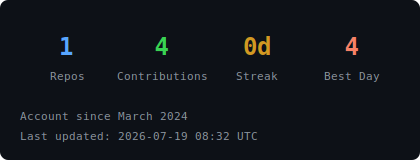

  <pre>
⠀⠀     ⢀⡴⠁⠀⠀⣿⡏⠀⠀⠱⣄
⠀⠀⢀⣴⡟⠁⠀⠀⠀⣿⡇⠀⠀⠀⠙⣷⣄
⠀⠀⠙⢿⣷⣄⠀⠀⠀⣿⡇⠀⠀⢀⣴⣿⠋
⠀⠀⠀⠀⠙⢿⣷⣄⠀⢻⡇⢀⣴⣿⠋
⠀⠀⠀⠀⠀⠀⠈⠻⣷⣾⣷⡿⠋
⠀⠀⠀⠀⠀⠀⠀⢀⣼⣿⣿⣷⣄
⠀⠀⠀⠀⠀⢀⣶⣿⠟⢹⣏⠻⢿⣷⣄
⠀⠀⠀⢀⣼⣿⠟⠁⠀⢸⣿⠀⠈⠙⢿⣷⣄
⠀⠀⣴⣿⡟⠁⠀⠀⠀⢸⣿⠀⠀⠀⠀⣹⣿⡷
⠀⠀⠈⠻⣿⣦⡀⠀⠀⢸⣿⠀⠀⢀⣼⣿⠏
⠀⠀⠀⠀⠈⠻⣿⣦⡀⢸⣿⠀⣴⣿⠟⠁
⠀⠀⠀⠀⠀⠀⠈⠻⣿⣾⣿⣾⡿⠃⠀
⠀⠀ ⠀⠀⠀⠀⠀⠀⠈⠻⡿⠋𒉭
  </pre>
  <h1>Capo</h1>
  

    <b>Software Developer &bull; SOC Analyst L2/L3 &bull; Penetration Tester</b>
  

  

    
    
  

   

---

## About Me

Software Developer with experience in mobile application development and digital platform design. Skilled in Flutter, JavaScript, UI/UX design, and database management. Built educational, healthcare, and service platforms with a solid foundation in **cybersecurity** and **penetration testing**. Currently operating as a **SOC Analyst Level 2/3** — triaging alerts, leading incident response, and conducting adversary emulation. Working with **Cortex XSOAR/SIEM** from Palo Alto Networks for SOAR automation and threat intelligence operations.

---

## Experience

**SOC Analyst L2/L3** &mdash; Present  
> Threat detection, incident response, SIEM/SOAR management (Cortex XSOAR), advanced threat hunting.

**Mobile Apps Developer (Freelance)** &mdash; 2022 &ndash; Present  
> Built the ZEDni educational platform for Arab Digital Health Academy, designed Knowledge Journey (children's education app), and developed UI/UX for Gate Fitness and Jabal Issa banking apps.

---

## Skills

### Development

### Cybersecurity

### SOC & Operations

---

## Certifications

- **Microsoft 365 Fundamentals** &mdash; Cloud Computing &amp; Productivity Services
- **Self-Taught Penetration Testing &amp; Cybersecurity Studies**

---

## GitHub Analytics

  

---

  <i>Threat detection by day, code by night.</i>

